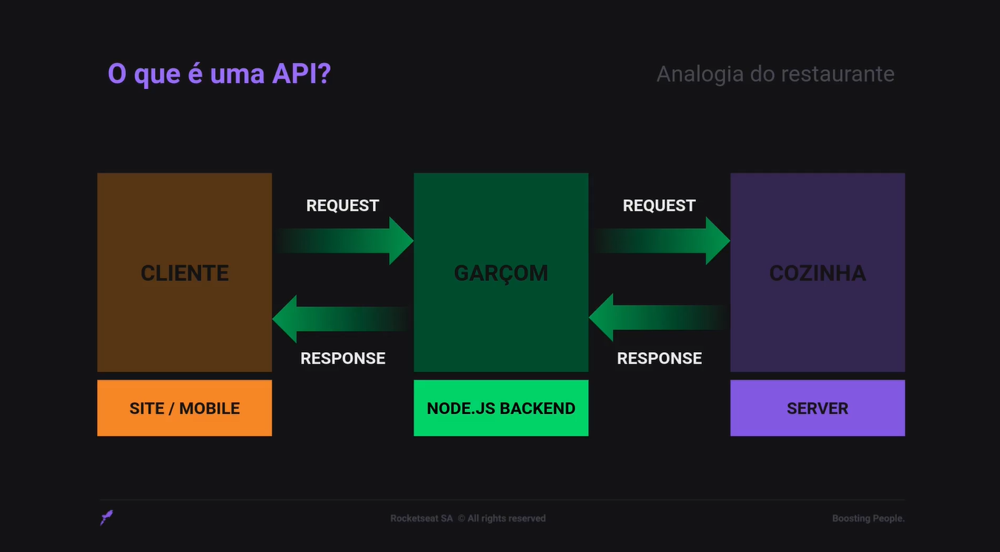
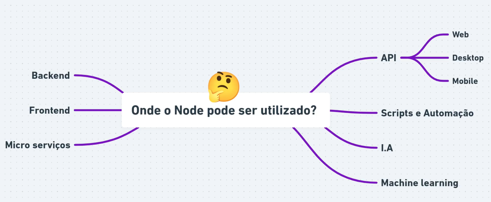
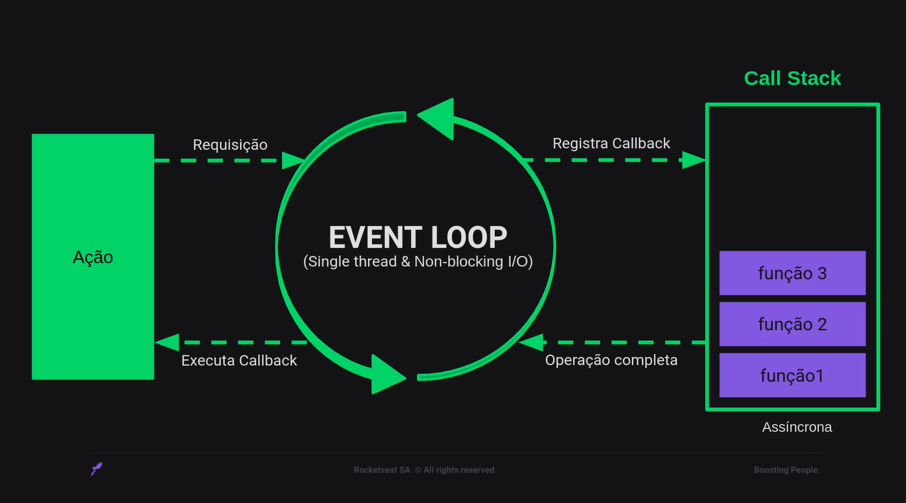
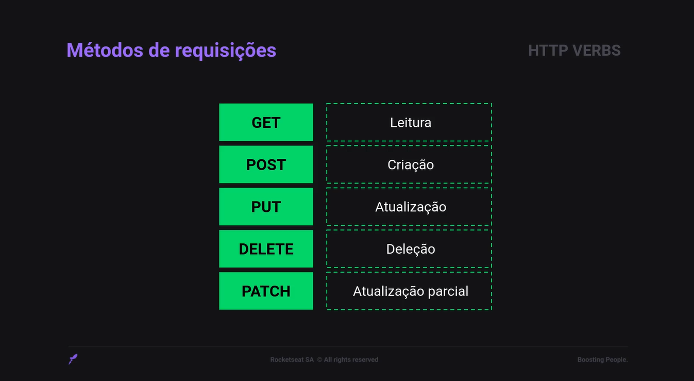

<h1>studying-about-nodejs</h1>

<h2>NodeJS</h2>

  Atributos e funcionamentos do Node, vantagens, variáveis globais, NPM, iniciação de pacotes, scripts, dependências globais, timers e módulos de eventos.

<h2>NodeJS + EJS</h2>

  Por meio do EJS é possível entender como o Javascript constrói o HTML com NodeJS e Express.

<h2>Javascript Assíncrono e Promises</h2>

  Como funciona o assincronismo no Javascript, callbacks, Promises e Async/Await.

<h2>Trabalhando com APIs</h2>

  Aprender o que são APIs, como criar APIs no Back-end e como consumir APIs no Front-end.

### 1. O que é uma API?

API - Application Programming Interface, ou Interface de Programação de Aplicação, é um termo para designar uma interface de comunicação que um sistema oferece para que outros acessem suas funções.

  

  

#### 4. Quais as vantagens?

Temos várias aplicações de ponta usando o Node.js pelos seguintes motivos:

  

### 5. v8 Engine

O v8 é um interpretador JavaScript. Desenvolvido pelo Google e utilizado em seu navegador Google Chrome. O v8 é desenvolvido em C++ com o objetivo de aumentar a performace de execução do JavaScript.

### 6. O funcionamento do Node.js

  

### 7. Express

O Express é um framework web muito rápido e flexível para a gente utilizar nas nossas aplicações Node para lidar com requisições feitas através da web, através do protocolo HTTP, também lidar com requisições, com respostas e por aí vai.

### 8. Métodos HTTP

Para se comunicar com uma API é necessario seguir alguns padrões. É aí que entram os métodos de requisições, também chamados como verbos HTTP, e são esses:

  

 

- GET para dizer ao nosso backend que queremos ler algum tipo de informação;
- POST para realizar a criação de alguma informação na aplicação;
- PUT para atualizar uma informação na aplicação;
- DELETE para deletar, ou seja, excluir uma informação;
- PATCH para fazer uma atualização expecífica de alguma informação.

